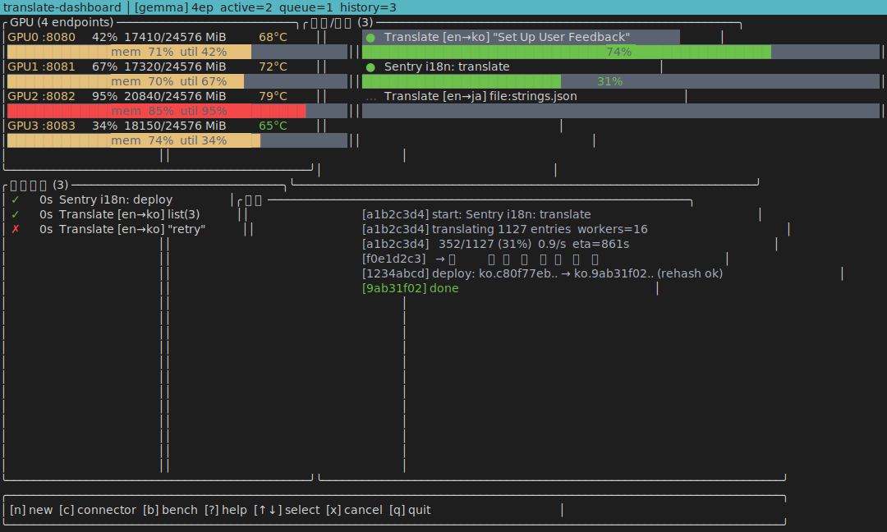

# gemma-translate

Self-hosted translation infrastructure powered by Google **TranslateGemma 27B-IT** (Gemma 3, 55 languages).
Single Rust binary manages install/start/stop across **three backends**: transformers, **llama.cpp (recommended)**, and vLLM.

```bash
# 1. Install
cargo install --git https://github.com/dalsoop/gemma-translate --path installer
sudo HF_TOKEN=hf_xxx gemma-translate llama-install \
  --from-local /path/to/translategemma-27b-it   # or let it download

# 2. Run (4 GPU tensor-split)
sudo gemma-translate llama-up 0,1,2,3 8080

# 3. Translate
curl -X POST http://localhost:8080/translate \
  -H 'Content-Type: application/json' \
  -d '{"text":"Hello, world!","source_lang_code":"en","target_lang_code":"ko"}'
# {"translation":"안녕하세요, 세상!"}
```

## Features

- **Single Rust CLI** manages everything (install, start, stop, model switch)
- **3 interchangeable backends**
  - `transformers` + NF4 — simplest (~0.3 req/s)
  - `llama.cpp` + Q4_K_M GGUF — **recommended** (**~15 req/s on 4× RTX 3090**, `--replicas 4`)
  - `vLLM` + BF16 — tensor-parallel (bare-metal only; LXC 에서는 NCCL 차단으로 불가)
- **Glossary**: standardized translations bypass the model (Save→저장 always)
- **API key auth** (optional, set `TRANSLATE_API_KEY`)
- **Placeholder preservation**: `%s`, `%d`, `{name}`, `${var}`, `[tag]`, `<code>` kept in position
- **systemd**-managed, auto-restart, upstream-ready gate
- **OpenAI-style** HTTP API on top of llama.cpp

## Requirements

- NVIDIA GPU
  - transformers NF4: ≥16 GB VRAM per instance
  - llama.cpp BF16 split across 4 GPUs: ≥14 GB per card
- NVIDIA driver + CUDA 12.4
- Python 3.10+ (for shim + server)
- Rust toolchain (to build the CLI)
- HuggingFace account with [Gemma license](https://huggingface.co/google/translategemma-27b-it) accepted

## Commands

```bash
# Installation
gemma-translate install                      # transformers backend
gemma-translate llama-install [--from-local DIR]
gemma-translate vllm-install

# Instance control (per port)
gemma-translate up|llama-up|vllm-up GPUS PORT
gemma-translate down|llama-down|vllm-down PORT
gemma-translate list
gemma-translate info PORT

# Glossary (standardized terms)
gemma-translate glossary add "Save" "저장" --target ko
gemma-translate glossary import ui-terms.json --target ko [--overwrite]
gemma-translate glossary export [--out file.json]
gemma-translate glossary list [--target ko]
gemma-translate glossary remove "Save" --target ko
```

## API

`POST /translate`
```json
{
  "text": "Hello world",
  "source_lang_code": "en",
  "target_lang_code": "ko",
  "max_new_tokens": 1024
}
```

Response:
```json
{ "translation": "안녕하세요 세상" }
// or glossary hit:
{ "translation": "저장", "source": "glossary" }
```

`GET /health`, `GET /info` — monitoring / metadata.

## Authentication

Set `TRANSLATE_API_KEY` before `llama-up`:
```bash
export TRANSLATE_API_KEY=$(openssl rand -hex 24)
sudo -E gemma-translate llama-up 0,1,2,3 8080
```
Clients must send `X-API-Key: <key>` or `Authorization: Bearer <key>`.

## Repository Layout

```
gemma-translate/
├── installer/          Rust CLI (clap + reqwest)
│   └── src/main.rs     install/up/down/list/info + llama-* + vllm-* + glossary
├── server/
│   ├── server.py       transformers FastAPI server (embedded in CLI)
│   └── requirements.txt
├── cli/
│   └── translate       Universal translate CLI (Python)
└── README.md
```

## License

- Code: **MIT**
- TranslateGemma model: [Gemma Terms of Use](https://ai.google.dev/gemma/terms)

---

## 한국어

(아래는 한국어 버전입니다. 영문과 동일.)

### 설치
```bash
cargo install --git https://github.com/dalsoop/gemma-translate --path installer
sudo HF_TOKEN=hf_xxx gemma-translate llama-install \
  --from-local /path/to/translategemma-27b-it
sudo gemma-translate llama-up 0,1,2,3 8080
```

### 특징
- 단일 Rust CLI 로 3개 백엔드 (transformers / llama.cpp / vLLM) 전환
- 글로서리 (표준 번역 사전) — `Save` 는 항상 `저장`
- 플레이스홀더 (`%s`, `{name}` 등) 위치 보존
- API 키 인증 옵션 (`TRANSLATE_API_KEY`)
- systemd 자동 기동 + upstream ready 대기

### 백엔드 선택
| 백엔드 | 처리량 | 특징 |
|-------|-------|------|
| transformers + NF4 | ~0.3 req/s | 단순, GPU 당 1 인스턴스 |
| **llama.cpp + BF16 GGUF** | **~2 req/s** | 4 GPU tensor-split + continuous batching |
| vLLM | 변동 | PagedAttention, 셋업 복잡 |

자세한 명령은 `gemma-translate --help` 참고.

## Links
- 
- 번역 결과물: [homelab-i18n](https://github.com/dalsoop/homelab-i18n)

## Dashboard (TUI)

Ratatui 기반 GPU 번역 대시보드. `dashboard/` 디렉토리.

```bash
cargo run --release -p translate-dashboard -- dashboard/config.json
```

| Key | Action |
|-----|--------|
| `n` | New job |
| `b` | Benchmark (10건 속도) |
| `c` | Connector switch |
| `?` | Help |
| `x` | Cancel job |
| `q` | Quit |


